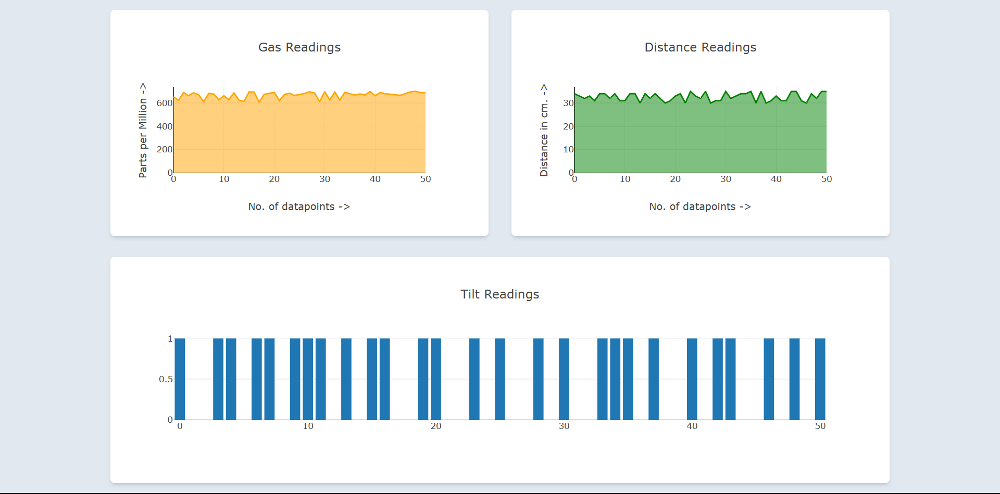

# Client
#### Getting Started
To get the React + Vite client up and running, follow these steps:

1. Make sure you have Node.js and npm (Node Package Manager) installed on your system. You can download them from [nodejs.org](https://nodejs.org/).

2. Clone this repository to your local machine using Git:

   ```bash
   git clone https://github.com/shreyanzjain/manole_monitoring_system.git
   ```
3. Change your current directory to the client directory within the cloned repository:
    ```bash 
    cd your-repository/client
    ```
4. Install project dependencies by running the following command:
    ```bash
    npm install
    ```

5. Once you upload and run the NodeMCU you will see it's IP ADDRESS in the serial monitor of your Arduino IDE. Configure your NodeMCU IP_ADDRESS inside the App.jsx file located at ```your-repository/client/src/App.jsx ```

6. Now, run the client using this command
    ```bash
    npm run dev
    ```

## Dashboard


# Server
The server folder contains the .ino Arduino file that can be uploaded to your NodeMCU.

## System Components
Our system uses the following components to monitor the conditions inside a manhole and create a server on port 8000 of the NodeMCU:

1. Gas Sensor
2. Waterproof Ultrasonic Sensor
3. Tilt Sensor

## Routes
To access the data collected by the NodeMCU server, you can use the following routes:

| Route            | Response Schema          |
|------------------|--------------------------|
| `/get/readings/` | `{gas, tilt, distance}` |

#### References
[Manhole Monitoring System](https://iotdesignpro.com/projects/iot-manhole-monitoring-system)